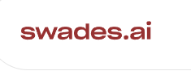
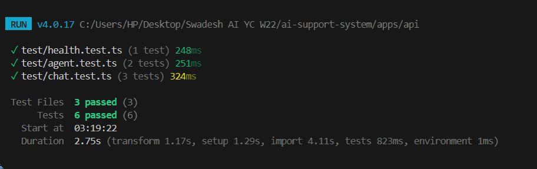
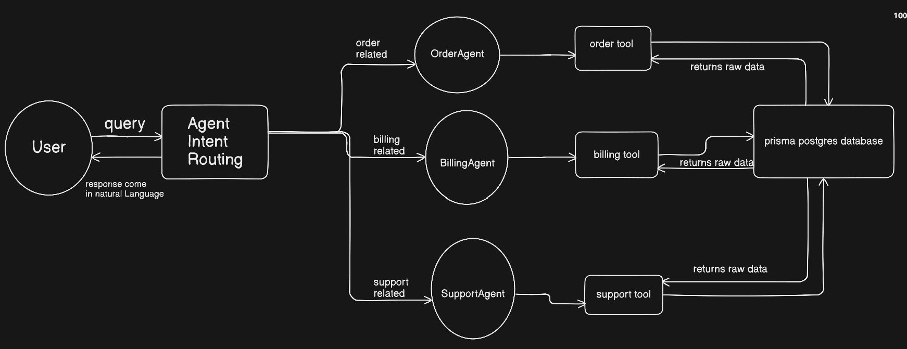

## swades.ai Full Stack Engineering Assessment


<p align="center">
  <a href="https://www.swades.ai/">
    
  </a>
</p>


## Steps to run the project


Clone the repository

```bash
git clone https://github.com/uchiha-vivek/Swades-AI-YC-W22-.git .
```

Install all the dependencies from the root 
```bash
npm i
```


Navigate to apps where the ui and backend is present

```bash
cd apps
```

Here `api` is the backend folder and `web` is the frontend folder

Navigate inside both the folders and run `npm install`


Inside packages folder all the `Database` logic is used

We have used database as `PostgreSQL` and ORM as `Prisma`


How to setup prisma stuff

```bash
cd packages
npx prisma studio
```


## API Usage and testing

`AGENT ROUTES`

**Getting all the available agents**

Method - GET

```bash
http://localhost:3001/api/agents
```


**Get Agent Capabilities**

METHOD -GET

**Order Agent**

```bash
http://localhost:3001/api/agents/order/capabilities
```

**Billing Agent**

```bash
http://localhost:3001/api/agents/billing/capabilities
```


**Support Agent**

```bash
http://localhost:3001/api/agents/support/capabilities
```


Checking **Rate Limiting**

```bash
http://localhost:3001/api/chat/messages
```

If more that 20 requests are send under 60000ms then Error **429** `Too many Requests will come`


**Chat Routes**

**NOTE** - This id is demo for now and in real production system this id can be generated after authentication so that it maps correctly to the specific user

Send New message

```bash
POST http://localhost:3001/api/chat/messages
```

The body which we are sending
```bash
{
  "userId": "55968d8b-a43a-48e6-bb0e-bd61ff16eb59",
  "message": "Where is my order?"
}
```

This `id` we will be getting from prisma studio


Expected Response 

```bash
{
  "conversationId": "UUID",
  "response": "Order ORD-1001 is currently \"shipped\" (Tracking ID: TRACK-123)"
}
```

This conversation id will be used in next iterations


### Checking Streaming version of response


For streaming we need to use curl

- Here the text streams chunk by chunk

```bash
curl -N -X POST http://localhost:3001/api/chat/messages/stream \
  -H "Content-Type: application/json" \
  -H "x-user-id: demo-user" \
  -d '{
    "userId": "<use-from-prisma-studio>",
    "message": "Where is my order?"
  }'
```

Listing conversations for users

METHOD - GET

```bash
http://localhost:3001/api/chat/conversations?userId=<prisma-user-id>
```

Getting conversation history

METHOD - GET

```bash
http://localhost:3001/api/chat/conversations/YOUR_CONVERSATION_ID
```


Deleting conversation ID

METHOD - DELETE

```bash
http://localhost:3001/api/chat/conversations/YOUR_CONVERSATION_ID
```


## How to run the tests

From the root navigate to `apps/api`

Run the following command

```bash
npm test
```


Below are the test cases screenshot




## INFRA and DEPLOYMENT

The **frontend** has been deployed in **Azure Static Web App**

[Frontend Deployed Link](https://white-sea-0e161590f.4.azurestaticapps.net/)


The **backend** has been deployed on **Azure App Service**

NOTE : Right now some minor issues exist with the backend


### Logging

**Logging Screenshot**


## System Design and Architecture

High Level Design - What's happening under the hood ?

